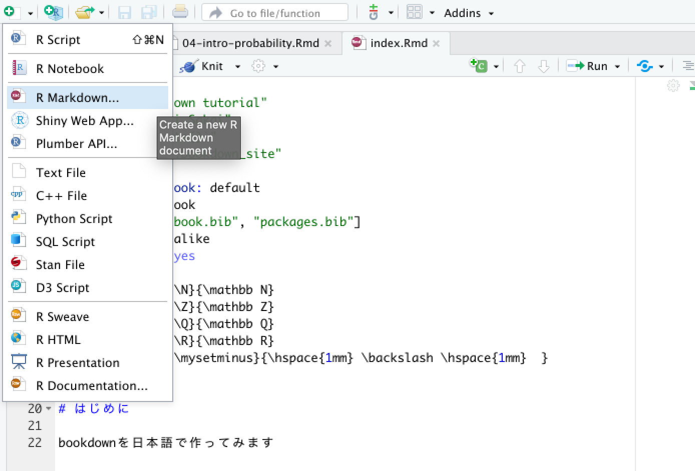
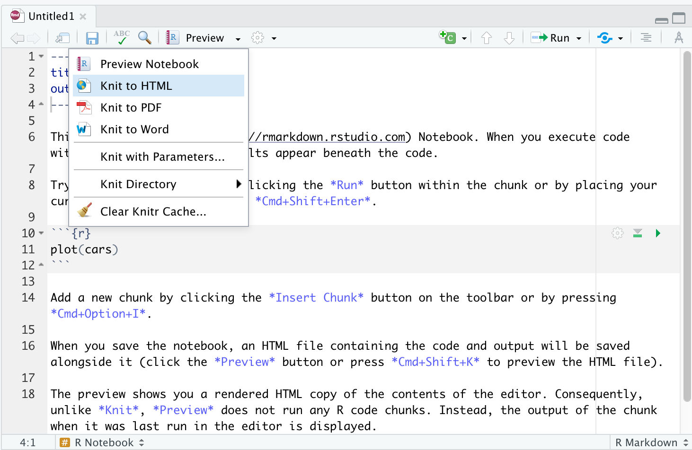

# R Notebookの書き方  

R NotebookではMarkdownベースの記法に従い文章を執筆することで，HTMLやPDFへ用意な出力が可能になります．

## R Notebookの基本:HTML  

R Notebookで記述したドキュメントは，HTMLやPDFなどで出力することができます．PDFを扱う場合は
少々エラーが起こりやすいのでここではHTMLのみに留めて紹介します．

### R Notebookファイルを作成する  

まずR Notebookファイルを作成してみましょう．Rstudioのウィンドウの一番左上にある＋ボタンを押し，R Notebookを選択します．これでR Notebookファイルが作成され新たなウィンドウが表示されます．

```{r, echo=FALSE}

```


### R NotebookによるHTMLの生成

新たなR Notebookファイルが表示されたら，そのままツールバーにあるPreviewの横にある下三角ボタンを押し，Knit to HTMLをクリックします．HTMLを生成する前にファイルを保存するように求められますので適当な場所に保存してください．

```{r, echo=FALSE} 

```

すると，Rのプレビュー機能によりHTMLが表示されます．これでR NotebookによるHTMLの生成は完了です．
以降は実際にR Notebookの中身を書き換えて再度knit to HTMLを実行することで更新されたHTMLを生成していくことになります．

生成されたHTMLファイルは，R Notebookファイルがあるところと同じフォルダに保存されます．

### YAMLヘッダー  

R Notebookファイルの先頭には以下のようなコードブロックがあったと思います．これをYAMLヘッダーと呼びます．この部分に適切にノートブックの設定を記述することで生成されるHTMLのフォーマットを変更することができます．その一部をここでは紹介します．

デフォルトで記述されているYAMLヘッダー．
```
---
title: "R Notebook"
output: html_notebook
---
```

YAMLヘッダー内では`key: value`の形式で記述します．入れ子にする場合は

```
key1:
  nested-key1: value1
  nested-key2: value2
```

のように記述します．

著者名とレポート日付はこのように記述します．

```
author: "your name"
date: "2021年12月31日"
```

次に，レポートの目次表示をする場合は以下のように記述します．

```
output:
  html_document:
    toc: true
```

またHTML上で画面内に常に目次を表示するようなfloating tocを利用するには

```
output:
  html_document:
    toc: true
    toc_float: true
```

とすれば有効になります．

最後に，これまで紹介してきたヘッダーを合わせると以下のようなYAMLヘッダーになります．

```
---
title: "Report title"
author: "Your name"
date: "YYYY-MM-DD"
output:
  html_document:
    toc: true
    toc_float: true
---
```

レポートを提出する際は，最低限名前と日付は入れておきましょう．


## Markdownの基本的な記法  

ここではMarkdownと呼ばれる記法について紹介します．Markdown自体は色々なサービスでも採用されている
記法です．その中でも基本的な見出し・箇条書き（番号あり・なし）コードブロック・その他書式設定について紹介していきます．

### 見出し  

行頭に`# `をつけることで見出しとして出力することができます．まだ`# `の数を増やすと入れ子にすることができます．

```
# 見出し1
## 見出し2
### 見出し3
```

### 箇条書き

箇条書きについては，以下のように記述します．

```
- item1
  - item2
- item3
  - item4
  - item5
    - item6
```

結果は以下の通りです．

- item1
  - item2
- item3
  - item4
  - item5
    - item6


番号付きにする場合は次のようにします．

```
1. item1  
    1. item2  
1. item3  
1. item4  
    1. item5  
        1. item6  
```

結果は以下の通りです．

1. item1  
    1. item2  
1. item3  
1. item4  
    1. item5  
        1. item6  

### コードブロック  

プログラムコードを通常のフォントで表示すると視認性が著しく失われることがあります（ほとんどの場合はそうです）．
例えば

a <- function(x){ <br>
  res <- x^3 <br>
  res += 10 <br>
} <br>
a(28)


という簡単なRのコードでも少し読みにくいことがわかると思います．

そこでMarkdownではプログラムコードはそれに適した書式で表示してくれる記法を用意しています．
文中においては```で囲み，独立してコードブロックを記述したい場合は

````
```
コードを記述
```
````

とします．

例を示します．文中にコード`program code`を表示する．program codeの部分の表示が少し変わっているのがわかると思います．
これが文中のコード表記です．

次に，複数行にわたるコードブロックの例を示します．

```
a <- function(x){
  res <- x^3
  res += 10
  return(res)
}
a(28)
```

これはR Notebook内では

````
```
a <- function(x){
  res <- x^3
  res += 10
  return(res)
}
```
````

と記述しています．プログラムとして読むにあたりかなり読みやすくなっていることがわかります．


### その他の書式設定

最後に，太字・斜体・リンクについて紹介します．太字にする場合`**`で太字にしたい文字列を囲みます．すると，このように**太字**になります．また，車体にしたい場合は`*`で文字列を囲みます．*斜体*になります．

次に，ある文字列にリンクを貼りたい場合は`[文字列](URL)`と記述することでリンク付き文字列として出力できます．
例えば，「自由学園」という文字列に自由学園のHPのリンクを貼る場合は`[自由学園のHPはこちら](https://jiyu.ac.jp)`とすれば

[自由学園のHPはこちら](https://jiyu.ac.jp)

のように，リンク付き文字列となります．


## Rのコードを記述する  

Rmarkdown中にチャンクと呼ばれるコードブロックを記述すると，そのコードブロック内でRを実行することができます．例えば下記のように記述してみると

````
`r ''````{r}
summary(cars)
`r ''````
````

というように`summary(cars)`が実行され，その結果を表示することができます．


```{r}
summary(cars)
```

さらに文章中でも実行することができます．その場合は例えば文中に

````
``r ''`r Sys.Date()`
````

というようにすれば実行できます．`Sys.Date()`という関数はその日の日付を返す関数です．実際にやってみると次のようになります．


「今日の日付は`r Sys.Date()`です．」


## Latex記法 

Rmarkdown中ではLatexを扱うことができます．Latexについては詳細は割愛しますが，Latexは数式に特化した記法で数式を綺麗に表示することができます．ここでは，本講義で扱うような記号についてのLatex表記を紹介します．Latexの表記自体は数多くあるため全てを紹介することはできませんが，興味のある人はウェブや書籍で調べてみてください．

### 基本的な使い方

Latexを扱うためには`$`か`$$`でLatex記法を囲む必要があります．文中で数式を各場合は`$`で囲めばよいです．例えば`$a + b = c$`という記述を文中ですることで「$a + b = c$」という結果を得ます．

数式を独立させる場合や複数行にわたる場合は`$$`で囲みます．記述例としては

```
$$
 f(x) = ax^2 + bx + c \\
 = h
$$
```

とすることで

$$
  f(x) = ax^2 + bx + c \\
  = h
$$
という結果を得ます．`\\`は改行を意味する記号です．

### 複数の数式を整列させる：align, gather

複数行にわたり数式を記述した際，数式を整列させるために`align`が便利です．

```
\begin{align}
ここに数式を記述する
\end{align}
```

このように`\begin{align}`と`\end{align}`で数式を挟みます．

$$
\begin{align}
  f(x) = x^2 + x + 1
\end{align}
$$
また，整列させる場合には各行の揃えたい部分に`&`を挿入します．

```
$$
\begin{align}
  f(x) &= x^2 + x + 1 \\
  &= (x + 0.5)^2 + 0.75
\end{align}
$$
```

$$
\begin{align}
  f(x) &= x^2 + x + 1 \\
  &= (x + 0.5)^2 + 0.75
\end{align}
$$
このように，それぞれの行において`&=`としているので`=`の位置が同じになるように調整されます．

各行を中央揃えにしたい場合は`gather`を使います．

$$
\begin{gather}
  f(x) = a + b \\
  g(x) = a + b + c \\
  h(x) = a + b + c + d
\end{gather}
$$

### 基本的な表記  

|意味|Latexコード|表示|
|:-|:-|:-|
|足算|`+`|$+$|
|引算|`-`|$-$|
|掛算|`\times`|$\times$|
|割算|`\div`|$\div$|
|分数|`\frac{a}{b}`|$\frac{a}{b}$|
|プラスマイナス|`\pm`|$\pm$|
|マイナスプラス|`\mp`|$\mp$|
|総和|`\sum_{i=1}^{n}`|$\sum_{i=1}^{n}$|
|総乗|`\prod_{i=1}^{n}`|$\prod_{i=1}^{n}$|
|階乗|`n!`|$n!$|
|点|`\dot`|$\cdot$|
|中段点列|`\cdots`|$\cdots$|
|下段点列|`\ldots`|$\ldots$|
|関数|`f(x)`|$f(x)$|
|無限大|`\infty`|$\infty$|
|下付き文字|`a_{11}$`|$a_{11}$|
|上付き文字|`b_{\alpha}`|$b_{\alpha}$|
|上下付き文字|`a_{i}^{(k)}`|$a_{i}^{(k)}$|

### 微分積分  

|意味|Latexコード|表示|
|:-|:-|:-|
|微分|`\frac{dy}{dx}`|$\frac{dy}{dx}$|
|微分|`f'(x)`|$f'(x)$|
|微分|`\frac{\partial f}{\partial x}`|$\frac{\partial f}{\partial x}$|
|積分|`\int`|$\int$|
|２重積分|`\iint`|$\iint$|
|$n$重積分|`\idotsint`|$\idotsint$|

### 論理演算  

|意味|Latexコード|表示|
|:-|:-|:-|
|ならば|`\Rightarrow`|$\Rightarrow$|
|同値|`\Leftrightarrow`|$\Leftrightarrow$|
|否定|`\lnot`|$\lnot$|
|論理積|`\land`|$\land$|
|論理和|`\lor`|$\lor$|
|排他的論理和|`\oplus`|$\oplus$|
|任意の|`\forall`|$\forall$|
|存在する|`\exists`|$\exists$|
|定義記号|`:=`|$:=$|


### 代表的な集合

|意味|Latexコード|表示|
|:-|:-|:-|
|自然数|`\mathbb N`|$\mathbb N$|
|整数|`\mathbb Z`|$\mathbb Z$|
|正の整数|`\mathbb Z^+`|$\mathbb Z^+$|
|有理数|`\mathbb Q`|$\mathbb Q$|
|無理数|`\mathbb R \setminus \mathbb Q`|$\mathbb R \setminus \mathbb Q$|
|実数|`\mathbb R`|$\mathbb R$|
|複素数|`\mathbb C`|$\mathbb C$|

### 集合演算  

|意味|Latexコード|表示|
|:-|:-|:-|
|含む|`\in `|$\in$|
|含まない|`\notin`|$\notin$|
|部分集合である|`\subset`|$\subset$|
|部分集合ではない|`\not\subset`|$\not\subset$|
|共通部分|`\cap `|$\cap$|
|共通部分|`\bigcap`|$\bigcap$|
|和集合|`\cup`|$\cup$|
|和集合|`\bigcup`|$\bigcup$|
|分割|`\sqcup`|$\sqcup$|
|分割|`\bigsqcup`|$\bigsqcup$|
|差集合|`\setminus`|$\setminus$|
|空集合|`\emptyset`|$\emptyset$|
|空集合|`\varnothing`|$\varnothing$|
|冪集合|`\mathfrak{P}(A)`|$\mathfrak{P}(A)$|
|冪集合|`\mathcal{P}(A)`|$\mathcal{P}(A)$|


### 場合の和・確率  

|意味|Latexコード|表示|
|:-|:-|:-|
|順列|`{}_n P_r`|${}_n P_r$|
|組み合わせ|`{}_n C_r`|${}_n C_r$|
|組み合わせ|`n \choose r`|$n \choose r$|
|確率変数$X$が標準正規分布に従う|`X \sim N(0,1) `|$X \sim N(0,1)$|
|独立に同一の分布に従う(i.i.d)|`\overset{\text\small\textrm{iid}}{\sim}`|$\overset{\textrm{iid}}{\sim}$|

### ベクトルと行列

縦・横ベクトル

```
$$
\begin{align}
  &\begin{pmatrix}
    a & b & c
  \end{pmatrix} \\
  &\begin{pmatrix}
    a \\ b \\ c
  \end{pmatrix}
\end{align}
$$
```


$$
\begin{gather}
  &\begin{pmatrix}
    a & b & c
  \end{pmatrix} \\
  &\begin{pmatrix}
    a \\ b \\ c
  \end{pmatrix}
\end{gather}
$$

行列  

```
$$
\begin{gather}
  &\begin{pmatrix}
    a_{11} & a_{12} & a_{13} \\
    a_{21} & a_{22} & a_{23} \\
  \end{pmatrix} \\ \\
  
  &\begin{bmatrix}
    a_{11} & a_{12} & a_{13} \\
    a_{21} & a_{22} & a_{23} \\
  \end{bmatrix} \\ \\
  
  &\begin{matrix}
    a_{11} & a_{12} & a_{13} \\
    a_{21} & a_{22} & a_{23} \\
  \end{matrix}
\end{gather}
$$
```


\begin{gather}
  &\begin{pmatrix}
    a_{11} & a_{12} & a_{13} \\
    a_{21} & a_{22} & a_{23} \\
  \end{pmatrix} \\ \\
  
  &\begin{bmatrix}
    a_{11} & a_{12} & a_{13} \\
    a_{21} & a_{22} & a_{23} \\
  \end{bmatrix} \\ \\
  
  &\begin{matrix}
    a_{11} & a_{12} & a_{13} \\
    a_{21} & a_{22} & a_{23} \\
  \end{matrix}
\end{gather}


### 場合分け  

```
$$
f(x) = 
\begin{cases}
  1 & \text{if} \hspace{3mm} 0 \leq x \leq 1 \\
  0 & \text{else}
\end{cases}
$$
```

$$
f(x) = 
\begin{cases}
  1 & \text{if} \hspace{3mm} 0 \leq x \leq 1 \\
  0 & \text{else}
\end{cases}
$$


### ギリシャ文字  

|意味|大文字|小文字|表示|
|:-|:-|:-|:-|
|アルファ|`A`|`\alpha`|$A, \alpha$|
|ベータ|`B`|`\beta`|$B, \beta$|
|ガンマ|`\Gamma, \varGamma`|`\gamma`|$\Gamma, \varGamma,\gamma$|
|デルタ|`\Delta, \varDelta`|`\delta`|$\Delta, \varDelta, \delta$|
|イプシロン|`E`|`\epsilon, \varepsilon`|$E, \epsilon, \varepsilon$|
|ゼータ|`Z`|`\zeta`|$Z, \zeta$|
|エータ|`H`|`\eta`|$H, \eta$|
|シータ|`\Theta, \varTheta`|`\theta, \vartheta`|$\Theta, \varTheta, \theta, \vartheta$|
|イオタ|`I`|`\iota`|$I, \iota$|
|カッパ|`K`|`\kappa, \varkappa`|$K, \kappa, \varkappa$|
|ラムダ|`\Lambda, \varLambda`|`\lambda`|$\Lambda, \varLambda, \lambda$|
|ミュー|`M`|`\mu`|$M, \mu$|
|ニュー|`N`|`\nu`|$N, \nu$|
|クシー・グザイ|`\Xi,\varXi`|`\xi`|$\Xi, \varXi, \xi$|
|オミクロン|`O`|`\o`|$O, o$|
|パイ|`\Pi,\varPi`|`\pi, \varpi`|$\Pi, \varPi, \pi, \varpi$|
|ロー|`\P`|`\rho, \varrho`|$P, \rho, \varrho$|
|シグマ|`\Sigma, \varSigma`|`\sigma, \varsigma`|$\Sigma, \varSigma, \sigma, \varsigma$|
|タウ|`T`|`\tau`|$T, \tau$|
|ウプシロン|`\Upsilon, \varUpsilon`|`\upsilon`|$\Upsilon, \varUpsilon, \upsilon$|
|ファイ|`\Phi, \varPhi`|`\phi, \varphi`|$\Phi, \varPhi, \phi, \varphi$|
|カイ|`X`|`\chi`|$X, \chi$|
|プサイ|`\Psi, \varPsi`|`\psi`|$\Psi, \varPsi, \psi$|
|オメガ|`\Omega, \varOmega`|`\omega`|$\Omega, \varOmega, \omega$|


